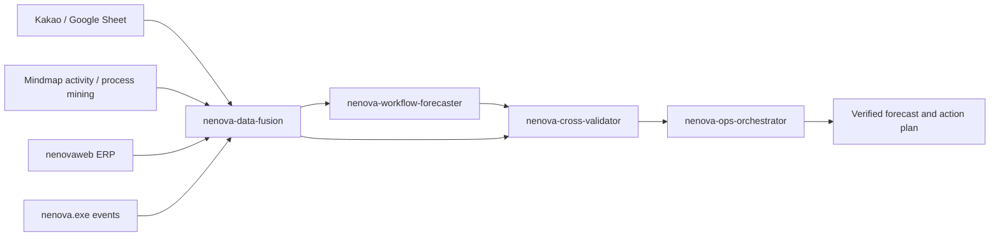

# Nenova Claude Agent Orchestration

Date: 2026-05-24 KST

This document defines the Claude-side agent team for Nenova workflow prediction, mutual verification, and work-unit detail preservation.

## Goal

Nenova should not rely on a single AI answer when predicting company-wide work. Claude should split the work into specialized agents, compare the results, and only then return an operational answer.

## Agent Team

| Agent | Purpose | Main Output |
| --- | --- | --- |
| `nenova-data-fusion` | Merge Kakao/Google Sheet, mindmap activity, nenovaweb ERP, and `nenova.exe` work events | Normalized work-unit candidates |
| `nenova-workflow-forecaster` | Predict employee and company workflow by minute/hour/day | Forecast, bottlenecks, automation candidates |
| `nenova-cross-validator` | Challenge predictions against other sources | PASS/WARN/FAIL validation table |
| `nenova-ops-orchestrator` | Coordinate the agent team and write the final answer | Verified operational plan |

## Data Flow



## Required Validation Gates

Every workflow forecast must include:

- Source coverage: Kakao/Sheet, mindmap, nenovaweb ERP, `nenova.exe`
- KST time alignment
- Employee identity mapping confidence
- Employee account and work-area mapping
- Click/work time matched to KakaoTalk/KakaoWork messages
- Reverse matching: PC work followed by reporting/customer messages
- ERP status consistency
- Source disagreement notes
- Final confidence score

## Work Unit Rules

The same rules are mirrored in the web UI and the agent instructions:

| Rule | Value |
| --- | --- |
| Merge window | 30 seconds |
| Session gap | 5 minutes |
| Minimum block | 5 seconds |
| Primary key | employee + time range + project/task/customer + activity |
| Evidence | account, work area, app name, window title, click count, screen/activity summary, ERP/Kakao links |

## Three-Way Cross Validation

Every employee work unit should be checked in three directions:

| Direction | Question | Result |
| --- | --- | --- |
| Kakao -> Work | Did a KakaoTalk/KakaoWork message trigger a PC or ERP task within 30 minutes? | `대화후작업` |
| Work -> Kakao | Did a PC or ERP task produce a follow-up/report/customer message within 30 minutes? | `작업후대화` |
| Same Time | Did the employee work inside Kakao while the conversation was happening? | `동시진행` |

The final answer should not say "the employee worked on X" unless at least two of these agree:

- KakaoTalk/KakaoWork message evidence
- PC app/window/click evidence
- nenovaweb ERP customer/project/task evidence

## Recommended Claude Prompt

```text
nenova-ops-orchestrator를 사용해서
네노바 카카오/구글시트 데이터, 마인드맵 직원 작업 데이터, nenovaweb ERP 데이터,
nenova.exe 작업 단위, 클릭 시간대, 카카오톡 대화 전후관계를 합친 뒤
회사 전체 워크플로우를 15분/60분/240분 단위로 예측해줘.

반드시 nenova-data-fusion, nenova-workflow-forecaster, nenova-cross-validator 순서로 검증하고
PASS/WARN/FAIL, 신뢰도, 계정별 업무영역, 대화↔작업 관계, 근거 작업 단위, 자동화 후보를 함께 출력해.
```

## Implementation Notes

- Agent files live in `.claude/agents/`.
- `nenovaweb` exposes work-unit visibility through `/work-units`.
- `nenova.exe` should send normalized activity payloads to `/api/work-units`.
- The AI assistant should include ERP and work-unit snapshots in its context before answering.
