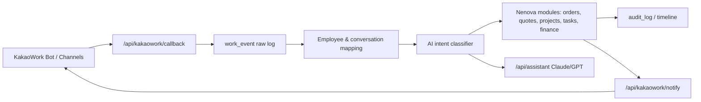

# Nenovaweb KakaoWork Integration Design

Date: 2026-05-24 KST

This document preserves the first-pass architecture for using KakaoWork as Nenova's company work interface while keeping `nenovaweb` as the system of record.

## Goal

Nenova staff should be able to work from KakaoWork while `nenovaweb` records the actual business state.

- A KakaoWork message can become an order, quote, project, task, schedule, approval, or AI question.
- A `nenovaweb` event can notify the right person or project conversation in KakaoWork.
- Every inbound message, classification result, generated work item, and status update is kept in an audit trail.
- Claude/GPT answers should use the same permission-aware company context used by `/assistant`.

## Official API Basis

KakaoWork Web API uses a Bot App Key in the HTTP `Authorization` header as `Bearer {YOUR_APP_KEY}`:

- Common guide: <https://docs.kakaoi.ai/kakao_work/webapireference/commonguide/>
- Messages: <https://docs.kakaoi.ai/kakao_work/webapireference/messages/>
- Conversations: <https://docs.kakaoi.ai/kakao_work/webapireference/conversations/>
- Users: <https://docs.kakaoi.ai/kakao_work/webapireference/users/>
- Organization: <https://docs.kakaoi.ai/kakao_work/webapireference/organization/>

Existing legacy code already uses:

- `POST https://api.kakaowork.com/v1/messages.send`
- `POST https://api.kakaowork.com/v1/conversations.open`

Those should be absorbed into `nenova-erp-ui` server routes rather than duplicated in browser code.

## Architecture



## Server Routes

### `GET /api/kakaowork/notify`

Returns integration readiness:

- `configured`
- `adminConversationConfigured`
- supported target types
- required and optional environment variables

### `POST /api/kakaowork/notify`

Sends or previews a KakaoWork message.

Request:

```json
{
  "text": "견적서 발송 후 3일 무응답 고객 팔로업 생성",
  "conversationId": "123",
  "email": "worker@example.com",
  "userId": 12345,
  "blocks": [],
  "dryRun": true
}
```

Rules:

- `text` is required.
- One of `conversationId`, `email`, or `userId` is required.
- `dryRun: true` never calls KakaoWork.
- If no Bot App Key exists, the route returns demo payload instead of failing.
- `email` uses `messages.send_by_email`.
- `conversationId` uses `messages.send`.
- `userId` opens a DM with `conversations.open`, then sends by `messages.send`.

### `POST /api/kakaowork/callback`

Receives KakaoWork or middleware events, stores them in a local `work_event` inbox, and registers a `KakaoWork` work-unit candidate.

Security:

- If `KAKAOWORK_CALLBACK_SECRET` is set, requests must include `x-nenova-kakaowork-secret` or `?secret=...`.
- The normalized inbox is stored at `nenova-erp-ui/data/kakaowork-events.json`.
- By default the callback also posts a candidate to `/api/work-units` so `/work-units` can later match the conversation with PC activity.
- Send `syncWorkUnit: false` to store only the callback event.

Response includes:

- `normalized`: KakaoWork event with inferred `intent` and `category`
- `workUnitSync`: `/api/work-units` sync result
- `nextPipeline`: employee mapping, AI classification, 30-minute PC/ERP cross-validation steps

### `GET /api/kakaowork/callback`

Returns the recent KakaoWork callback inbox and storage status.

### `GET /api/employees/directory`

Returns the internal employee identity map used by KakaoWork callbacks and work-unit ingestion.

Example:

```http
GET /api/employees/directory?userEmail=worker@example.com
```

The response includes the resolved internal `employee`, `accountId`, `team`, `defaultWorkArea`, and the match source such as `email`, `kakaoworkUserId`, `orbitUserId`, `hostname`, or `name`.

### `GET/POST/PATCH /api/erp/intake`

Stores actionable KakaoWork requests as ERP intake drafts.

- `GET /api/erp/intake`: list recent quote/task/inventory/finance/project drafts
- `POST /api/erp/intake`: upsert one or more intake drafts
- `PATCH /api/erp/intake`: update `status` such as `전환완료` or `보류`
- When an intake item is converted, PATCH should also store `linkedEntityType`, `linkedEntityId`, `convertedAt`, and `conversionNote`.

KakaoWork callback automatically posts quote/task/inventory/finance/project intents into this inbox unless `syncErpIntake: false` is provided.

Current draft extraction:

- Customer is parsed from phrases such as `고객사: ...`, `거래처 ...`, `대한상사에서 견적 ...`, and English `for ...`.
- Amount is parsed from `320만원`, `1,200,000원`, `1.5억`, and amount keywords like `견적 320만`.
- Due date is parsed from `오늘`, `내일`, `모레`, `5월 30일`, `2026-05-30`, `D+3`, and weekday phrases such as `다음주 금요일`.

## Environment Variables

```bash
KAKAOWORK_BOT_APP_KEY=...
KAKAOWORK_ADMIN_CONVERSATION_ID=...
KAKAOWORK_CALLBACK_SECRET=...
NENOVA_PUBLIC_BASE_URL=https://nenovaweb.com
```

Backward compatibility:

- Existing legacy names `KAKAOTALK_TOKEN` and `KAKAO_ADMIN_CONV_ID` can still be read during migration.
- New code should prefer `KAKAOWORK_BOT_APP_KEY` and `KAKAOWORK_ADMIN_CONVERSATION_ID`.

## Data Model

Suggested tables or collections:

| Entity | Purpose | Key Fields |
| --- | --- | --- |
| `employee` | Map Nenova staff to KakaoWork users | `id`, `email`, `kakaowork_user_id`, `display_identifier`, `role` |
| `work_channel` | Map KakaoWork conversations to teams/projects | `conversation_id`, `type`, `project_id`, `team_id`, `owner_id` |
| `work_event` | Immutable inbound/outbound event log | `id`, `source`, `raw_payload`, `normalized`, `intent`, `created_item_id` |
| `task_update` | Status/comment updates from KakaoWork | `task_id`, `actor_id`, `status`, `comment`, `acted_at` |
| `notification_attempt` | Delivery and retry trail | `target`, `payload`, `status`, `error`, `attempted_at` |

## Core Workflows

1. Staff writes in KakaoWork: "호남소재 견적서 내일까지 작성해줘."
2. Callback stores raw event.
3. User and conversation are mapped to Nenova employee/project.
4. AI classifier extracts `intent=quote`, customer, due date, assignee candidate, missing fields.
5. Nenova creates quote draft and task.
6. KakaoWork sends confirmation to assignee and project channel.
7. Staff clicks or replies "완료".
8. Callback updates task status and writes audit log.

Current `nenovaweb` behavior:

- Quote-like intake items become meeting/record candidates first, so the existing quote creation flow can add amount and due date before contract confirmation.
- Quote-like intake items with a parsed amount become quote drafts immediately after conversion.
- Other actionable intake items become assigned tasks.
- The server intake record keeps the generated local ERP object ID, allowing later cross-checks between KakaoWork message, work unit, PC activity, and ERP result.

## Security Rules

- Never expose the Bot App Key in client-side code.
- Inbound actions must be checked against Nenova user permissions.
- AI context must be filtered by employee role before sending to Claude/GPT.
- Raw messages are retained, but sensitive fields should be masked in general dashboards.
- Delete and approval actions need a second confirmation or admin permission.

## Implementation Phases

### Phase 1: Foundation

- Add `/kakaowork` design page.
- Add `/api/kakaowork/notify` dry-run/live route.
- Add `/api/kakaowork/callback` normalization route.
- Document env vars and mapping.

### Phase 2: Mapping

- Add employee to KakaoWork user mapping.
- Add project/team channel mapping.
- Connect admin conversation ID and project channel IDs.

### Phase 3: Work Creation

- Classify incoming messages into order, quote, project, task, finance, inventory, and question.
- Store raw event and generated work item ID.
- Return confirmation message to KakaoWork.

### Phase 4: AI Assistant

- Route KakaoWork questions into `/api/assistant`.
- Add role-based context retrieval.
- Add summary cards back to `nenovaweb` dashboard.

### Phase 5: Operations

- Add retry queue for failed KakaoWork sends.
- Add daily digest.
- Add admin audit view and rate-limit/error dashboard.
